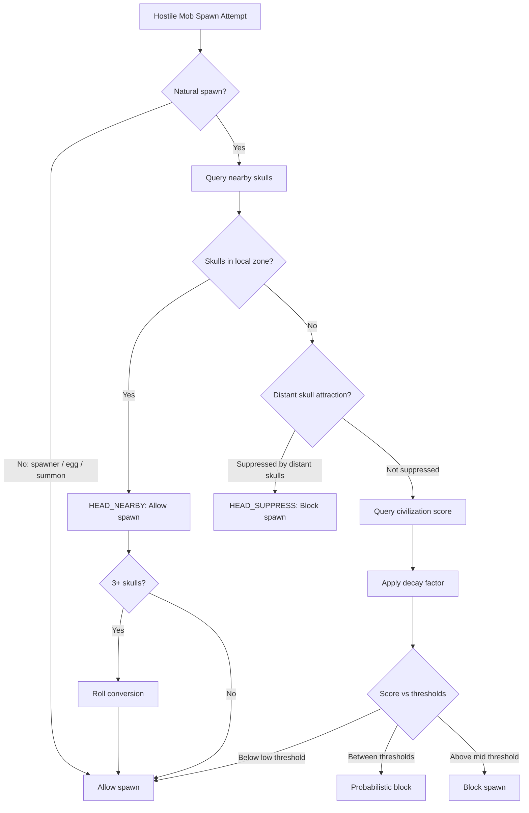
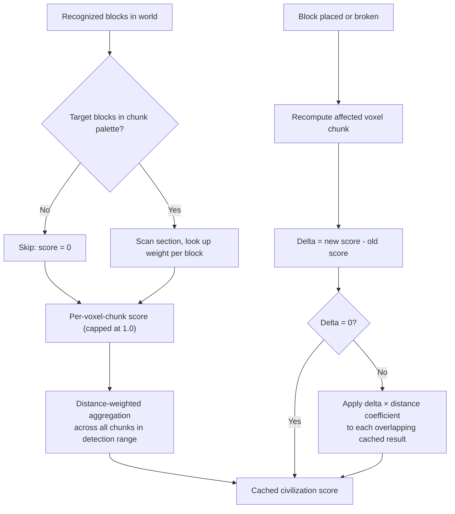
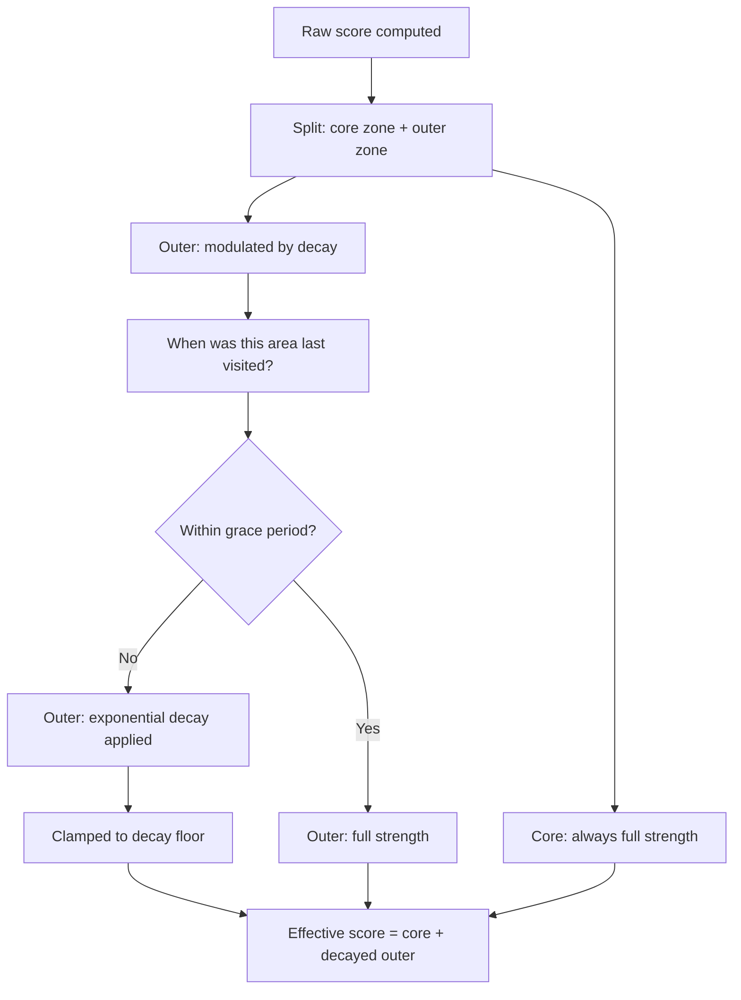
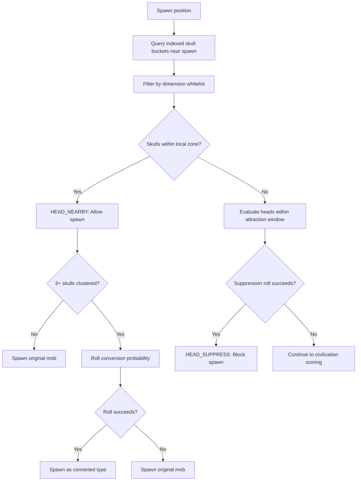
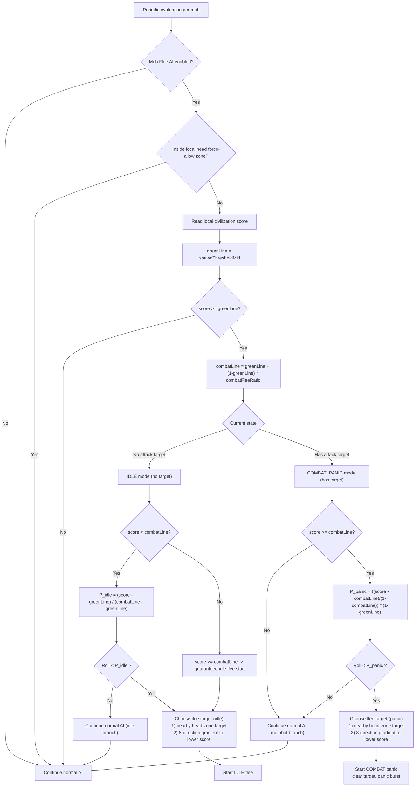
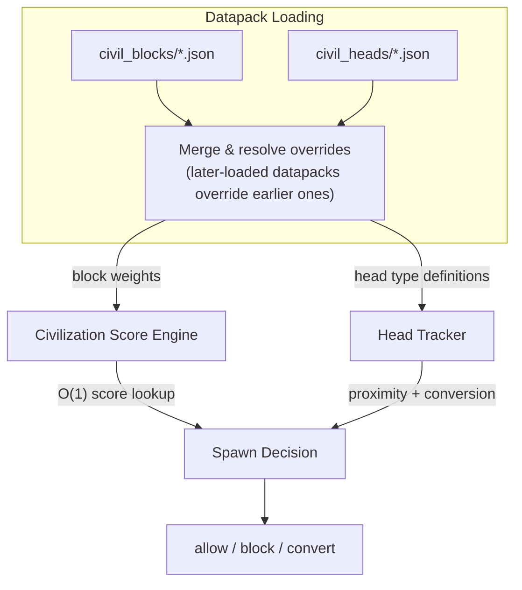

# Architecture Overview

This page illustrates how Civillis decides whether a hostile mob is allowed to spawn, and how the major systems — civilization scoring, decay, and monster heads — interact.

---

## Spawn Decision Workflow

Every time Minecraft's natural spawn cycle tries to place a hostile mob, Civillis intercepts and runs the following decision pipeline:

Non-natural spawns (spawn eggs, spawners, `/summon`, reinforcements) bypass the pipeline entirely and always succeed.

---

## Civilization Score

The score represents how "civilized" an area is. It is computed once per detection area and then kept up to date incrementally:

- Each 16³ voxel chunk scores the weighted sum of recognized blocks inside it, capped at 1.0
- The detection range (default 240×240×48 blocks) defines how many chunks are aggregated
- After the initial computation, block changes only recompute the single affected chunk and propagate the difference — the cached score is never fully recomputed

---

## Decay Integration

Civilization protection is not permanent. The decay system modulates the outer-zone contribution of the civilization score based on player presence:

When a player returns, their presence gradually advances the recorded visit time, restoring the outer zone contribution step by step.

---

## Monster Head Interaction

Monster heads operate on a separate pathway that runs *before* the civilization score is even consulted:

- Skulls restricted to specific dimensions (e.g., wither skeleton skulls → Nether only) are filtered out before any mechanism activates
- Conversion probability scales with skull count; converted mobs bypass this pipeline on their own spawn to prevent recursion
- Distant suppression is range-bounded and index-backed: only heads in the local attraction window are considered

---

## Mob Flee Behavior Layer

Mob Flee AI runs as a post-spawn behavior layer for existing hostile mobs. It does not replace spawn gating; it complements it.

- Spawn gating decides whether a new hostile mob is allowed to appear
- Mob Flee AI decides whether an already-existing hostile mob should retreat from civilization pressure

In dense city cores, flee logic may escalate to panic-like retreat behavior (including possible combat disengagement), while outer civilized zones usually produce softer outward drift.

---

## Registry Loading & Injection

The mod's behavior is entirely data-driven. Two JSON registries are loaded at startup (and on `/reload`) and injected into the runtime systems:

- Block weight registry determines which blocks are recognized and how much each contributes to civilization score
- Head type registry determines which skull types are active, their dimension restrictions, and whether they participate in conversion
- Both registries support full datapack override: modpacks can add, modify, or replace entries without touching mod code
