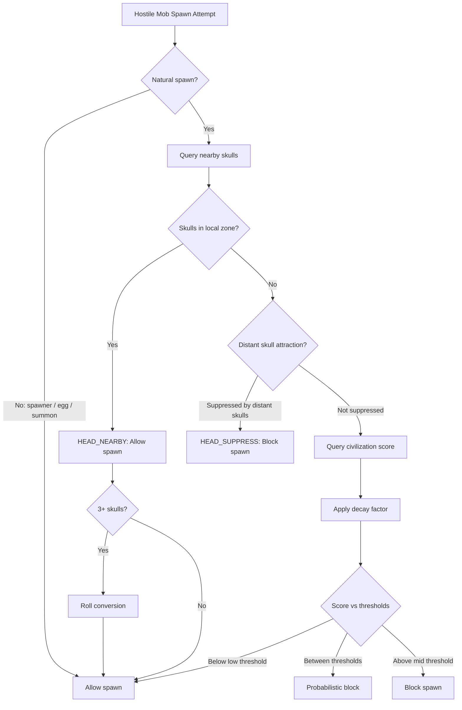
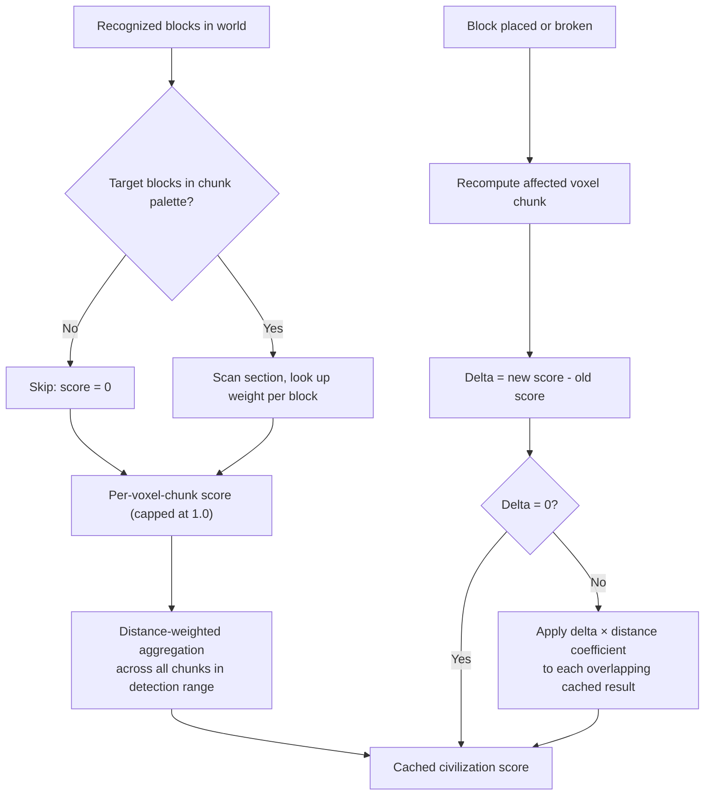
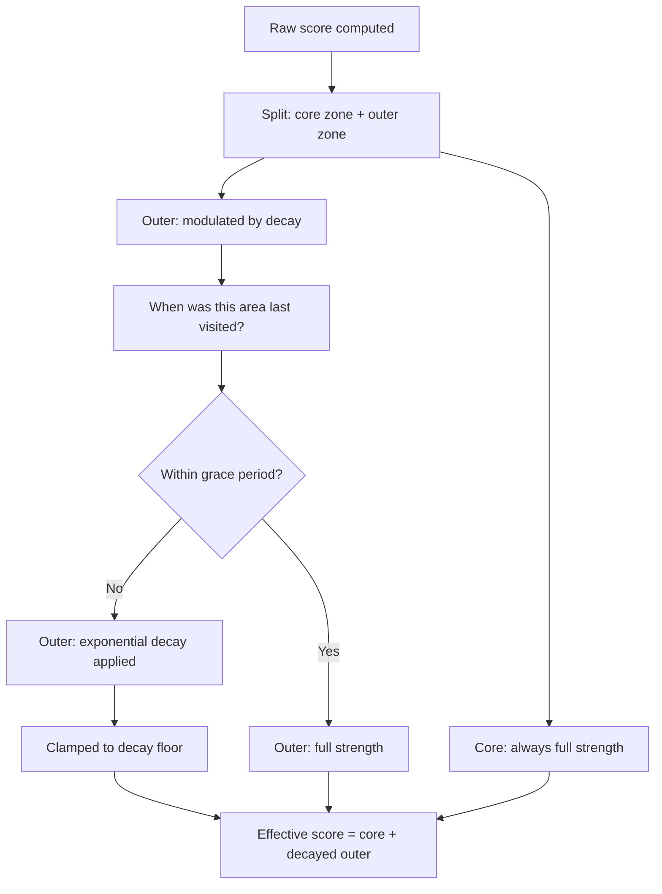
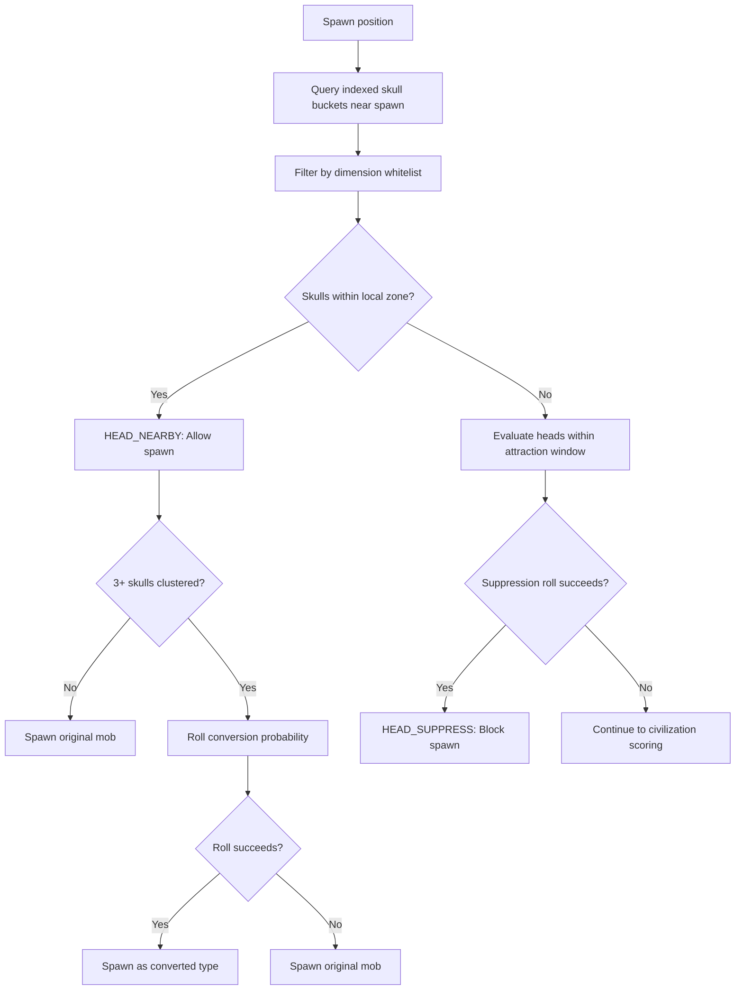
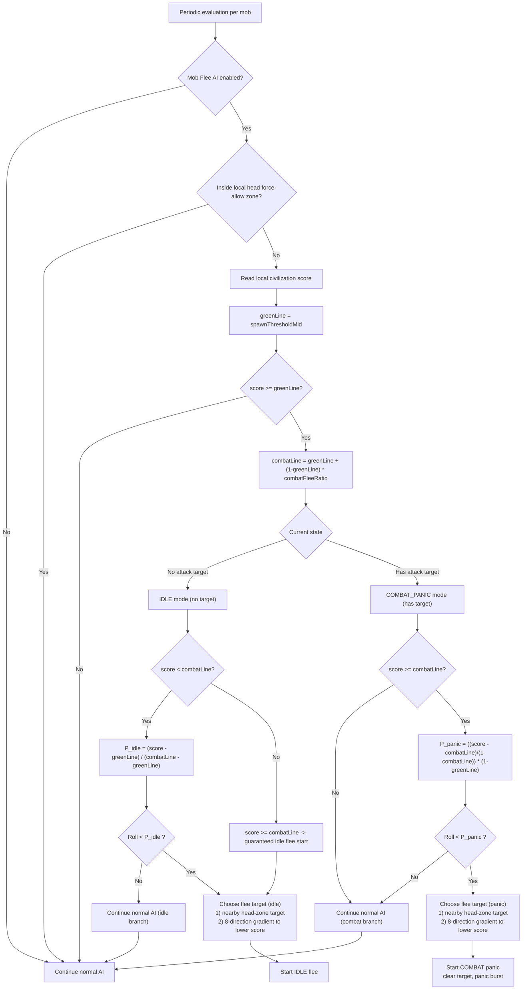
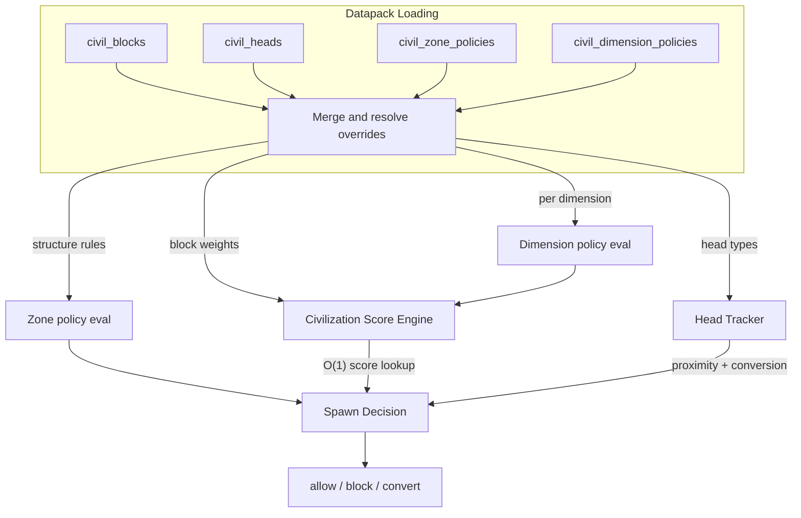

# Architecture Overview

This page illustrates how Civillis decides whether a hostile mob is allowed to spawn, and how the major systems — civilization scoring, decay, and monster heads — interact.

---

## Spawn Decision Workflow

Every time Minecraft's natural spawn cycle tries to place a hostile mob, Civillis intercepts and runs the following decision pipeline:

```mermaid
flowchart TD
    SpawnAttempt["Hostile Mob Spawn Attempt"]
    NaturalCheck{Natural spawn?}
    HeadQuery["Query nearby skulls"]
    HasNearby{Skulls in local zone?}
    HeadNearby["HEAD_NEARBY: Allow spawn"]
    ConvertCheck{3+ skulls?}
    ConvertMob["Roll conversion"]
    HeadAttract{Distant skull attraction?}
    HeadSuppress["HEAD_SUPPRESS: Block spawn"]
    ScoreQuery["Query civilization score"]
    ApplyDecay["Apply decay factor"]
    ThresholdCheck{Score vs thresholds}
    Allow["Allow spawn"]
    Probabilistic["Probabilistic block"]
    Block["Block spawn"]

    SpawnAttempt --> NaturalCheck
    NaturalCheck -->|No: spawner / egg / summon| Allow
    NaturalCheck -->|Yes| HeadQuery
    HeadQuery --> HasNearby
    HasNearby -->|Yes| HeadNearby
    HeadNearby --> ConvertCheck
    ConvertCheck -->|Yes| ConvertMob
    ConvertCheck -->|No| Allow
    ConvertMob --> Allow
    HasNearby -->|No| HeadAttract
    HeadAttract -->|Suppressed by distant skulls| HeadSuppress
    HeadAttract -->|Not suppressed| ScoreQuery
    ScoreQuery --> ApplyDecay
    ApplyDecay --> ThresholdCheck
    ThresholdCheck -->|Below low threshold| Allow
    ThresholdCheck -->|Between thresholds| Probabilistic
    ThresholdCheck -->|Above mid threshold| Block
```

Non-natural spawns (spawn eggs, spawners, `/summon`, reinforcements) bypass the pipeline entirely and always succeed.

**Datapack hooks:** Before civilization scoring runs, **dimension policies** (`civil_dimension_policies`) can disable civilization logic (and optionally head stages) per dimension. **Zone policies** (`civil_zone_policies`) can allow hostile spawns inside matched vanilla structures regardless of nearby score. See [Structure spawn rules](../play/structure-spawn-rules.md), [Dimension rules](../play/dimension-rules.md), and [Data-Driven Registries](../modpack/data-driven.md).

---

## Persistence (NBT storage)

Civillis **does not use an embedded SQL database**. Since the 1.2.0 storage rewrite, civilization **L1 shard** scores, **ServerClock**, decay **presence** data, **mob head** positions, and **Podium of Undying** anchors are persisted through a dedicated **NBT-based storage layer** with **asynchronous I/O**. Dirty data is **staged in memory** and written in a **unified flush** about every **30 seconds** (600 ticks), not as a synchronous follow-up to every cache mutation. On cold paths, **bulk region load** pulls an entire on-disk region into L1 once; that region is then marked **activated** so repeated work does not re-read the same NBT bulk until the next flush **deactivates** it after persisting. Result shards remain **derived cache** in memory and are rebuilt from L1 when needed.

World switches keep each world's data isolated; see the changelog for storage-related upgrade notes.

---

## Decay scheduling and prefetch

Outer-zone decay is advanced by a **player-aware prefetch / round-robin** system so work tracks where players actually patrol. **Wilderness** is cheap: the engine avoids spending decay budget on areas that are not meaningfully tied to player presence, while civilized frontiers stay consistent with the decay model described below.

---

## Civilization Score

The score represents how "civilized" an area is. It is computed once per detection area and then kept up to date incrementally:

```mermaid
flowchart TD
    Blocks["Recognized blocks in world"]
    Palette{"Target blocks in chunk palette?"}
    SkipChunk["Skip: score = 0"]
    Weight["Scan section, look up weight per block"]
    VCScore["Per-voxel-chunk score (capped at 1.0)"]
    Aggregate["Distance-weighted aggregation<br/>across all chunks in detection range"]
    Score["Cached civilization score"]

    Change["Block placed or broken"]
    Recompute["Recompute affected voxel chunk"]
    Delta["Delta = new score - old score"]
    DeltaZero{Delta = 0?}
    Propagate["Apply delta × distance coefficient<br/>to each overlapping cached result"]

    Blocks --> Palette
    Palette -->|No| SkipChunk --> VCScore
    Palette -->|Yes| Weight --> VCScore
    VCScore --> Aggregate --> Score

    Change --> Recompute --> Delta --> DeltaZero
    DeltaZero -->|Yes| Score
    DeltaZero -->|No| Propagate --> Score
```

- Each 16³ voxel chunk scores the weighted sum of recognized blocks inside it, capped at 1.0
- The detection range (default 240×240×48 blocks) defines how many chunks are aggregated
- After the initial computation, block changes only recompute the single affected chunk and propagate the difference — the cached score is never fully recomputed

---

## Decay Integration

Civilization protection is not permanent. The decay system modulates the outer-zone contribution of the civilization score based on player presence:

```mermaid
flowchart TD
    ScoreComputed["Raw score computed"]
    SplitZones["Split: core zone + outer zone"]
    CoreScore["Core: always full strength"]
    OuterScore["Outer: modulated by decay"]
    PresenceCheck["When was this area last visited?"]
    GracePeriod{Within grace period?}
    FullOuter["Outer: full strength"]
    DecayApply["Outer: exponential decay applied"]
    FloorCheck["Clamped to decay floor"]
    CombinedScore["Effective score = core + decayed outer"]

    ScoreComputed --> SplitZones
    SplitZones --> CoreScore
    SplitZones --> OuterScore
    OuterScore --> PresenceCheck
    PresenceCheck --> GracePeriod
    GracePeriod -->|Yes| FullOuter
    GracePeriod -->|No| DecayApply
    DecayApply --> FloorCheck
    FloorCheck --> CombinedScore
    FullOuter --> CombinedScore
    CoreScore --> CombinedScore
```

When a player returns, their presence gradually advances the recorded visit time, restoring the outer zone contribution step by step.

---

## Monster Head Interaction

Monster heads operate on a separate pathway that runs *before* the civilization score is even consulted:

```mermaid
flowchart TD
    SpawnPos["Spawn position"]
    ScanHeads["Query indexed skull buckets near spawn"]
    DimFilter["Filter by dimension whitelist"]
    LocalZone{Skulls within local zone?}
    AllowSpawn["HEAD_NEARBY: Allow spawn"]
    CountHeads{"3+ skulls clustered?"}
    NoConvert["Spawn original mob"]
    RollConvert["Roll conversion probability"]
    ConvertSuccess{Roll succeeds?}
    SpawnConverted["Spawn as converted type"]
    SpawnOriginal["Spawn original mob"]
    DistantCalc["Evaluate heads within attraction window"]
    SuppressRoll{Suppression roll succeeds?}
    BlockSpawn["HEAD_SUPPRESS: Block spawn"]
    ContinueToCiv["Continue to civilization scoring"]

    SpawnPos --> ScanHeads --> DimFilter --> LocalZone
    LocalZone -->|Yes| AllowSpawn --> CountHeads
    CountHeads -->|No| NoConvert
    CountHeads -->|Yes| RollConvert --> ConvertSuccess
    ConvertSuccess -->|Yes| SpawnConverted
    ConvertSuccess -->|No| SpawnOriginal
    LocalZone -->|No| DistantCalc --> SuppressRoll
    SuppressRoll -->|Yes| BlockSpawn
    SuppressRoll -->|No| ContinueToCiv
```

- Skulls restricted to specific dimensions (e.g., wither skeleton skulls → Nether only) are filtered out before any mechanism activates
- Conversion probability scales with skull count; converted mobs bypass this pipeline on their own spawn to prevent recursion
- Distant suppression is range-bounded and index-backed: only heads in the local attraction window are considered

---

## Mob Flee Behavior Layer

Mob Flee AI runs as a post-spawn behavior layer for existing hostile mobs. It does not replace spawn gating; it complements it.

- Spawn gating decides whether a new hostile mob is allowed to appear
- Mob Flee AI decides whether an already-existing hostile mob should retreat from civilization pressure

High-pressure cores get panic-like retreat (including possible combat disengagement); lighter pressure produces outward drift.

```mermaid
flowchart TD
    Tick["Periodic evaluation per mob"]
    Enabled{"Mob Flee AI enabled?"}
    HeadZone{"Inside local head force-allow zone?"}
    Score["Read local civilization score"]
    GreenLine["greenLine = spawnThresholdMid"]
    AboveGreen{score >= greenLine?}
    CombatLine["combatLine = greenLine + (1-greenLine) * combatFleeRatio"]

    ModeCheck{"Current state"}
    IdleBranch["IDLE mode (no target)"]
    CombatBranch["COMBAT_PANIC mode (has target)"]

    IdleZone{score < combatLine?}
    IdleProb["P_idle = (score - greenLine) / (combatLine - greenLine)"]
    IdleRoll{"Roll < P_idle ?"}
    IdleForce["score >= combatLine -> guaranteed idle flee start"]

    CombatGate{score >= combatLine?}
    CombatProb["P_panic = ((score - combatLine)/(1-combatLine)) * (1-greenLine)"]
    CombatRoll{"Roll < P_panic ?"}

    FindTargetIdle["Choose flee target (idle)<br/>1) nearby head-zone target<br/>2) 8-direction gradient to lower score"]
    FindTargetPanic["Choose flee target (panic)<br/>1) nearby head-zone target<br/>2) 8-direction gradient to lower score"]
    StartIdle["Start IDLE flee"]
    StartPanic["Start COMBAT panic<br/>clear target, panic burst"]
    ContinueIdle["Continue normal AI (idle branch)"]
    ContinueCombat["Continue normal AI (combat branch)"]
    Continue["Continue normal AI"]

    Tick --> Enabled
    Enabled -->|No| Continue
    Enabled -->|Yes| HeadZone
    HeadZone -->|Yes| Continue
    HeadZone -->|No| Score --> GreenLine --> AboveGreen
    AboveGreen -->|No| Continue
    AboveGreen -->|Yes| CombatLine --> ModeCheck

    ModeCheck -->|No attack target| IdleBranch --> IdleZone
    IdleZone -->|Yes| IdleProb --> IdleRoll
    IdleRoll -->|No| ContinueIdle
    IdleRoll -->|Yes| FindTargetIdle --> StartIdle
    IdleZone -->|No| IdleForce --> FindTargetIdle

    ModeCheck -->|Has attack target| CombatBranch --> CombatGate
    CombatGate -->|No| ContinueCombat
    CombatGate -->|Yes| CombatProb --> CombatRoll
    CombatRoll -->|No| ContinueCombat
    CombatRoll -->|Yes| FindTargetPanic --> StartPanic

    ContinueIdle --> Continue
    ContinueCombat --> Continue
```

---

## Registry Loading & Injection

The mod's rules are largely data-driven. JSON registries under `data/<namespace>/…` load at startup and on `/reload`:

```mermaid
flowchart TD
    subgraph Load [Datapack Loading]
        BW["civil_blocks"]
        HT["civil_heads"]
        ZP["civil_zone_policies"]
        DP["civil_dimension_policies"]
        Merge["Merge and resolve overrides"]

        BW --> Merge
        HT --> Merge
        ZP --> Merge
        DP --> Merge
    end

    Merge -->|block weights| ScoreEngine["Civilization Score Engine"]
    Merge -->|head types| HeadTracker["Head Tracker"]
    Merge -->|structure rules| ZonePolicies["Zone policy eval"]
    Merge -->|per dimension| DimPolicies["Dimension policy eval"]

    DimPolicies --> ScoreEngine
    ZonePolicies --> SpawnDecision["Spawn Decision"]
    ScoreEngine -->|"O(1) score lookup"| SpawnDecision
    HeadTracker -->|"proximity + conversion"| SpawnDecision
    SpawnDecision --> Outcome["allow / block / convert"]
```

- **civil_blocks** — recognized blocks and weights for scoring
- **civil_heads** — skull types, dimensions, conversion flags
- **civil_zone_policies** — structure-tagged spawn exceptions (e.g. monuments)
- **civil_dimension_policies** — per-dimension toggles for civilization and head mechanics

Modpacks can add, modify, or replace entries without touching mod code. Details: [Data-Driven Registries](../modpack/data-driven.md).
