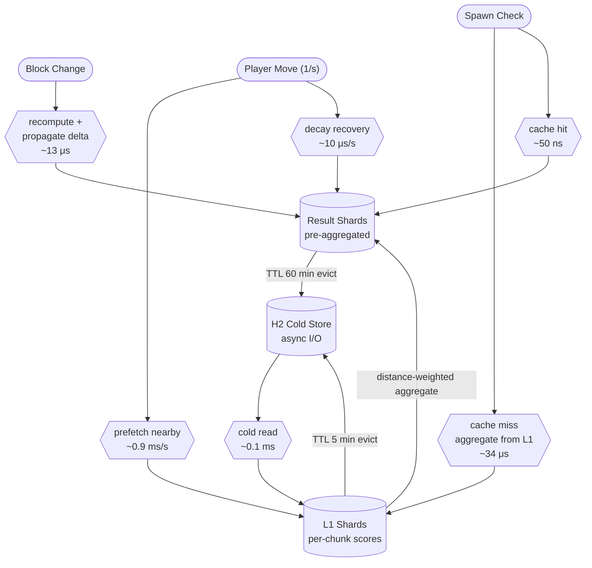

# Performance

Civillis evaluates millions of blocks per spawn attempt while keeping each check at near-constant time. This page explains the optimization strategy and its real-world cost profile.

---

## The Core Challenge

Every time a hostile mob tries to spawn naturally, the engine must answer: *"How civilized is this location?"* This requires aggregating block data across a configurable detection area (default 240×240×48 blocks = 675 voxel chunks). Doing this naively on every spawn attempt would be catastrophically expensive.

The solution is a **shard-based caching engine** built on three pillars:

1. **Pre-aggregated results** — The 675-chunk aggregation is computed once and cached. Subsequent spawn checks are a single map lookup: **O(1), ~50 ns**.
2. **Delta propagation** — When blocks change, only the affected shard is recomputed and the difference is applied to cached results. No full re-aggregation ever runs after the initial computation.
3. **Palette pre-filtering** — Before scanning 4,096 blocks in a chunk section, the engine checks Minecraft's internal block palette for recognized civilization blocks. Sections with no targets are skipped in ~1 μs instead of a ~100 μs full scan — in wilderness this eliminates virtually 100% of scanning work.

---

## Civilization Scoring Engine

The following diagram shows the full data flow through the scoring engine — the component responsible for the O(1) spawn checks. All key paths (spawn checks, block changes, cold loading, prefetching, TTL eviction) are shown with their typical costs.

### Cost Summary

| Operation | Typical cost | Frequency |
|-----------|-------------|-----------|
| Spawn check (warm) | ~50 ns | Every natural spawn attempt |
| Spawn check (cold) | ~34 μs | First spawn in a new area |
| L1 compute (palette skip) | ~1 μs | Most chunk sections |
| L1 compute (full scan) | ~100 μs | Sections with civilization blocks |
| Block change + delta | ~13 μs | Every block placement/removal |
| Database cold read | ~0.1 ms | L1 evicted from memory |
| Prefetch per player (moved) | ~0.9 ms/s | Once per second when player moves |
| Prefetch per player (stationary) | ~0.01 ms/s | Once per second (presence only) |

The scoring engine alone scales comfortably to hundreds of players. The real cost story, however, depends on what happens *around* it.

---

## Mob Flee AI Performance Notes

Mob Flee AI is a behavior-layer system and is intentionally decoupled from the O(1) civilization score query path.

- It does not change the cache topology (L1/Result shards) or delta propagation math
- It runs on periodic evaluations per mob (interval + jitter), not every tick for every mob
- Its practical cost scales with active hostile mob count and configured flee cadence

If a server needs stricter performance limits, `mobFlee.enabled=false` fully disables this behavior without affecting spawn suppression, decay, or head attraction.

---

## Runtime Cost Profile

At runtime, the core paths are all stable:

- Civilization score query is O(1) on warm cache (map lookup)
- Block change update stays constant-time at shard level (recompute + delta propagation)
- Monster head checks are handled by spatial indexing, so typical overhead remains low

This means Civillis has no obvious performance hotspot in normal deployments. The dominant variable is still spawn-attempt volume (mob-cap churn), not one specific subsystem.

### What Drives Cost on Live Servers

- **Spawn churn**: dark civilized areas can increase retry volume when mob cap fills slowly
- **Player movement**: prefetch and cache maintenance scale with active movement
- **Extreme local head density**: only when many enabled heads are packed into one active area

### Multiplayer Server Budget

The table below gives a compact planning view for common server sizes.

| Server stage | Typical active pattern | Prefetch + presence | Spawn pipeline | Total Civillis cost | Tick budget used |
|--------------|------------------------|---------------------|----------------|---------------------|------------------|
| Small (~10 players) | 3 explorers + 7 builders in lit bases | ~0.14 ms/tick | ~0.12 ms/tick | ~0.26 ms/tick | ~0.5% |
| Medium (~50 players) | 10 explorers + 40 builders across multiple bases | ~0.49 ms/tick | ~0.75 ms/tick | ~1.24 ms/tick | ~2.5% |
| Large (~100 players) | 20 explorers + 80 builders, mixed lighting quality | ~0.98 ms/tick | ~2.60 ms/tick | ~3.58 ms/tick | ~7.2% |

All values are rounded estimates under the stated assumptions; total cost is the sum of the two component columns in each row.

!!! note "Observed upside in very large modpacks"
    In some heavy modpack environments, Civillis can improve overall server performance instead of only adding overhead.
    Real user feedback confirms this in **Minecraft 1.20.1 Forge** with **300+ mods**: by reducing hostile mob pressure near established bases, total active-entity load and nearby AI churn can drop, which improves practical TPS stability.
    Treat this as an observed field result under specific pack conditions, not as a universal guarantee.

!!! warning "Edge case: very dense head hotspots"
    If many enabled heads are concentrated in one active attraction area, head-query overhead can become noticeable.
    Mitigation is straightforward: spread clusters, disable unused head types, or reduce attraction radius.
