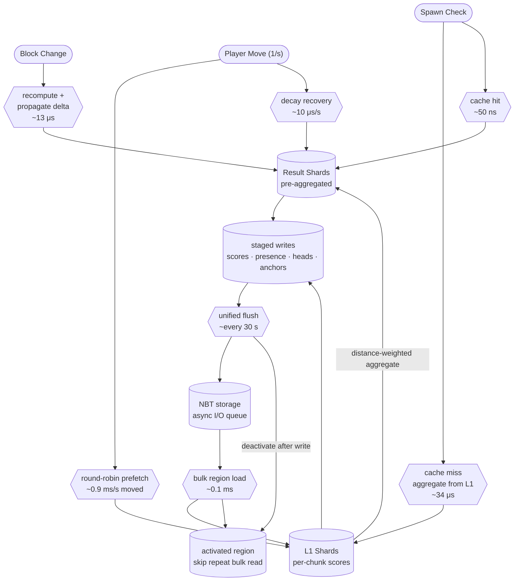

# Performance

A naive spawn check would scan a huge block volume every time; Civillis keeps the **hot path** at near-constant time via caching. This page is the optimization story and a practical cost sketch.

---

## The Core Challenge

Every time a hostile mob tries to spawn naturally, the engine must answer: *"How civilized is this location?"* This requires aggregating block data across a configurable detection area (default 240×240×48 blocks = 675 voxel chunks). Doing this naively on every spawn attempt would be catastrophically expensive.

The solution is a **shard-based caching engine** built on three pillars:

1. **Pre-aggregated results** — The 675-chunk aggregation is computed once and cached. Subsequent spawn checks are a single map lookup: **O(1), ~50 ns**.
2. **Delta propagation** — When blocks change, only the affected shard is recomputed and the difference is applied to cached results. No full re-aggregation ever runs after the initial computation.
3. **Palette pre-filtering** — Before scanning 4,096 blocks in a chunk section, the engine checks the section palette for recognized civilization blocks. Sections with no targets skip the full scan (~1 μs vs ~100 μs); empty wilderness sections drop out early.

---

## Civilization Scoring Engine

The following diagram shows the full data flow through the scoring engine — the component responsible for the O(1) spawn checks. It includes **batched persistence** (staged writes + periodic unified flush), **bulk region load** with **activation** (avoid repeating the same cold NBT read until after a flush), **player-aware prefetch** (round-robin consumption with a per-tick budget), and in-memory **TTL** cleanup on L1 / Result caches.

```mermaid
flowchart TD
    SpawnCheck(["Spawn Check"])
    BlockChange(["Block Change"])

    SpawnCheck ~~~ BlockChange

    Miss{{"cache miss<br/>aggregate from L1<br/>~34 μs"}}
    Hit{{"cache hit<br/>~50 ns"}}
    Delta{{"recompute +<br/>propagate delta<br/>~13 μs"}}

    L1[("L1 Shards<br/>per-chunk scores")]
    Result[("Result Shards<br/>pre-aggregated")]

    SpawnCheck --> Miss --> L1
    SpawnCheck --> Hit --> Result
    BlockChange --> Delta --> Result

    L1 -->|"distance-weighted aggregate"| Result

    NbtStore[("NBT storage<br/>async I/O queue")]
    Bulk{{"bulk region load<br/>~0.1 ms"}}
    Activated[("activated region<br/>skip repeat bulk read")]

    NbtStore --> Bulk --> L1
    Bulk --> Activated

    Staged[("staged writes<br/>scores · presence · heads · anchors")]
    UnifiedFlush{{"unified flush<br/>~every 30 s"}}

    L1 --> Staged
    Result --> Staged
    Staged --> UnifiedFlush --> NbtStore
    UnifiedFlush -->|"deactivate after write"| Activated

    Prefetch{{"round-robin prefetch<br/>~0.9 ms/s moved"}}
    Presence{{"decay recovery<br/>~10 μs/s"}}
    PlayerMove(["Player Move (1/s)"])

    PlayerMove --> Prefetch --> L1
    PlayerMove --> Presence --> Result
```

### Cost Summary

| Operation | Typical cost | Frequency |
|-----------|-------------|-----------|
| Spawn check (warm) | ~50 ns | Every natural spawn attempt |
| Spawn check (cold) | ~34 μs | First spawn in a new area |
| L1 compute (palette skip) | ~1 μs | Most chunk sections |
| L1 compute (full scan) | ~100 μs | Sections with civilization blocks |
| Block change + delta | ~13 μs | Every block placement/removal |
| Bulk region load (disk) | ~0.1 ms | First cold touch per **region** while not activated |
| Unified flush to disk | amortized | About every **30 s**; batches L1/presence plus dirty heads, anchors, meta |
| In-memory TTL cleanup | small | Every **5 s** on L1 / Result caches (not a per-evict disk write) |
| Prefetch per player (moved) | ~0.9 ms/s | Once per second when player moves (round-robin queue + per-tick budget) |
| Prefetch per player (stationary) | ~0.01 ms/s | Once per second (presence-oriented work) |

The scoring engine alone scales comfortably to hundreds of players. The real cost story, however, depends on what happens *around* it.

### Decay prefetch (round-robin)

Decay-related work is driven by a **round-robin prefetch engine** tied to player movement and patrol semantics: **wilderness** does not burn server time on background decay the way dense civilized areas do. The engine maintains **per-player prefetch queues** and consumes them with a configurable **per-tick result budget** (epoch-style receipts avoid stale work after world changes). That keeps idle-world cost down while keeping outer-zone decay responsive where players actually matter.

---

## Mob Flee AI Performance Notes

Mob Flee AI is a behavior-layer system and is intentionally decoupled from the O(1) civilization score query path.

- It does not change the cache topology (L1/Result shards) or delta propagation math
- It runs on periodic evaluations per mob (interval + jitter), not every tick for every mob
- Its practical cost scales with active hostile mob count and configured flee cadence

If a server needs stricter performance limits, `mobFlee.enabled=false` fully disables this behavior without affecting spawn suppression, decay, or head attraction.

---

## Runtime Cost Profile

At runtime, the core paths are all stable:

- Civilization score query is O(1) on warm cache (map lookup)
- Block change update stays constant-time at shard level (recompute + delta propagation)
- Podium of Spawning / monster-head checks are handled by spatial indexing, so typical overhead remains low
- Civil map tinting uses sparse per-chunk surface sampling rather than full-column scans

This means Civillis has no obvious performance hotspot in normal deployments. The dominant variable is still spawn-attempt volume (mob-cap churn), not one specific subsystem.

### What Drives Cost on Live Servers

- **Spawn churn**: dark civilized areas can increase retry volume when mob cap fills slowly
- **Player movement**: prefetch and cache maintenance scale with active movement
- **External map overlays**: JourneyMap / Xaero overlays can scan wider areas than a handheld civil map; supported builds start them disabled by default
- **Extreme local podium head density**: only when many enabled heads are packed into one active podium pocket

### Multiplayer Server Budget

The table below gives a compact planning view for common server sizes. **Prefetch** = prefetch + presence work; **Spawn** = spawn pipeline; sums are **total Civillis** time per tick. The **%** is that total as a share of a nominal **20 ms** tick budget.

| Server stage | Typical active pattern | Prefetch + Spawn ≈ total (≈ % of tick) |
|--------------|------------------------|--------------------------------------|
| Small (~10 players) | 3 explorers + 7 builders in lit bases | **0.14** + **0.12** ≈ **0.26** ms/tick (~**0.5%**) |
| Medium (~50 players) | 10 explorers + 40 builders across multiple bases | **0.49** + **0.75** ≈ **1.24** ms/tick (~**2.5%**) |
| Large (~100 players) | 20 explorers + 80 builders, mixed lighting quality | **0.98** + **2.60** ≈ **3.58** ms/tick (~**7.2%**) |

All values are rounded estimates under the stated assumptions.

!!! tip "Observed upside in very large modpacks"
    In some heavy modpack environments, Civillis can improve overall server performance instead of only adding overhead.
    Real user feedback confirms this in **Minecraft 1.20.1 Forge** with **300+ mods**: by reducing hostile mob pressure near established bases, total active-entity load and nearby AI churn can drop, which improves practical TPS stability.
    Treat this as an observed field result under specific pack conditions, not as a universal guarantee.

!!! warning "Edge case: very dense head hotspots"
    If many enabled heads are concentrated in one active attraction area, head-query overhead can become noticeable.
    Mitigation is straightforward: spread clusters, disable unused head types, or reduce attraction radius.

---

## Civil Maps and Overlays

Civil maps bake small palette changes into vanilla map updates. The server samples representative surface height per chunk and evaluates one tint band (civilized, monster pocket, or none) for that chunk. Recent builds use a fixed sparse sample grid for surface height, cutting per-chunk map work while keeping region-scale tinting accurate.

External overlays (JourneyMap / Xaero on supported port lines) are different: they may explore server-side region data for a live minimap or world-map overlay. Because that can grow with exploration radius, those integrations start disabled by default on the supported lines and should be enabled deliberately.
